# M3E4Unity — Material 3 Expressive for Unity

[](LICENSE)


**Material 3 Expressive for Unity uGUI**, ported from the official sources (Jetpack Compose Material 3,
material-color-utilities, AndroidX graphics-shapes) rather than re-drawn by eye. Layout values, colors,
shapes and spring motion come from the upstream code. It runs in plain Unity and in VRChat worlds (UdonSharp).

[日本語はこちら](#日本語)

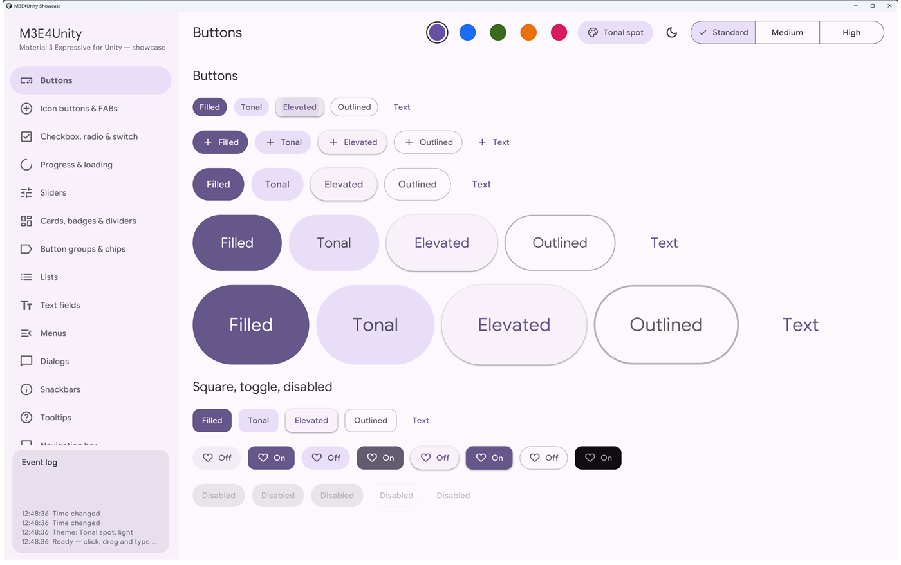

## Contents

- [What is ported](#what-is-ported)
- [Components](#components)
- [Installation](#installation)
- [Quick start](#quick-start)
- [Showcase app](#showcase-app)
- [How it works](#how-it-works)
- [Known differences](#known-differences)
- [Repository layout](#repository-layout)
- [Development](#development)
- [License](#license)

## What is ported

| Area | Source | Notes |
| --- | --- | --- |
| Dynamic color | [material-color-utilities](https://github.com/material-foundation/material-color-utilities) (Java) | Mechanically converted. All scheme variants, palettes and contrast levels. Verified against the Java output: 0 mismatches over 7,168 schemes. |
| Tokens | Compose Material 3 `tokens/*.kt` | 114 token objects (2,537 values) generated into `ComponentTokens.g.cs`, plus the type scale and shape scale. |
| Shapes | AndroidX graphics-shapes + `MaterialShapes` | The 35 Material shapes and shape morphing, rendered with an analytic SDF shader. |
| Motion | Compose `MotionScheme` / `SpringSimulation` | Expressive and standard spatial / effects springs, evaluated in closed form. |
| Components | Compose `XxxDefaults` and component code (not just tokens) | Measure policies, colors, state layers, ripples and animations follow the Compose implementation. |
| Strings | Compose `strings.xml` (en) | Titles, placeholders and error messages. |

## Components

| | |
| --- | --- |
| 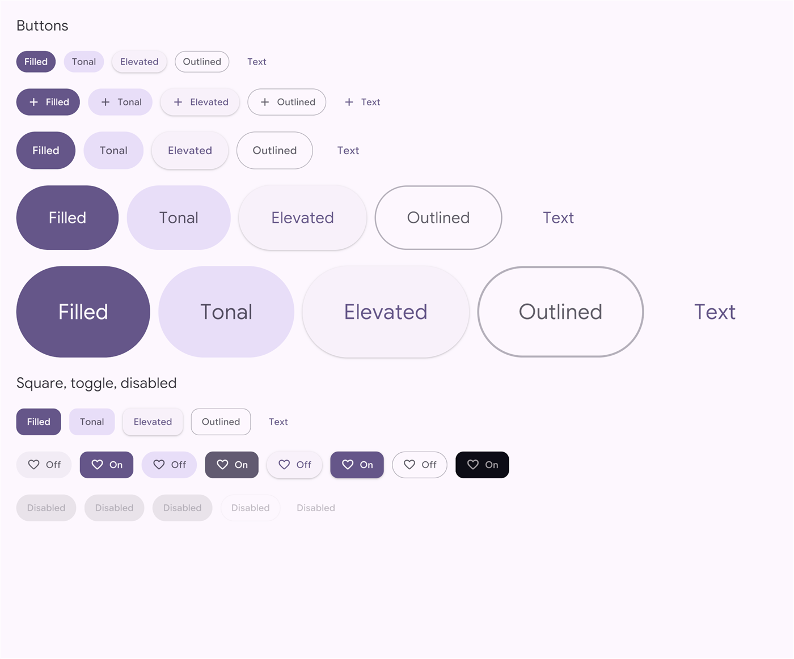 | 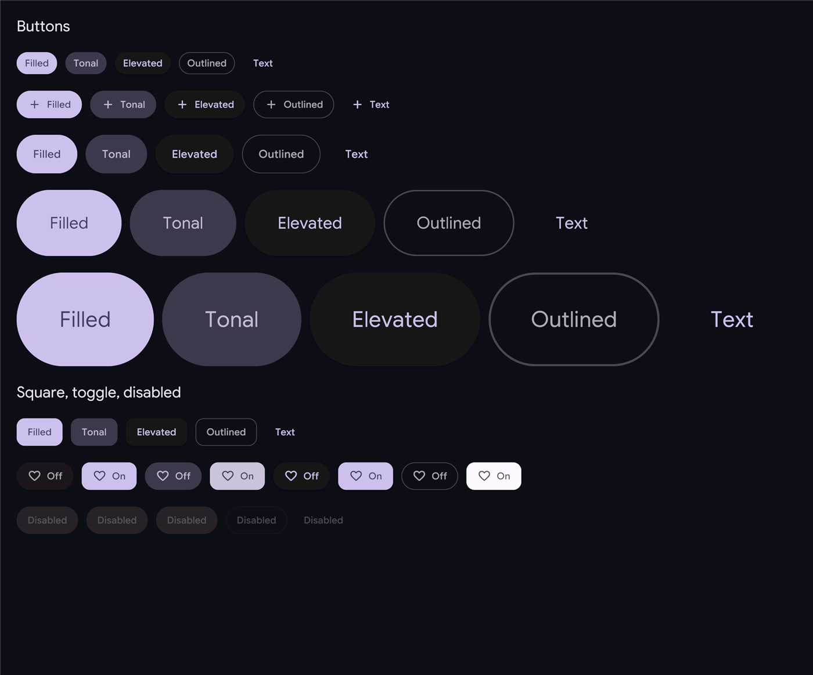 |
| 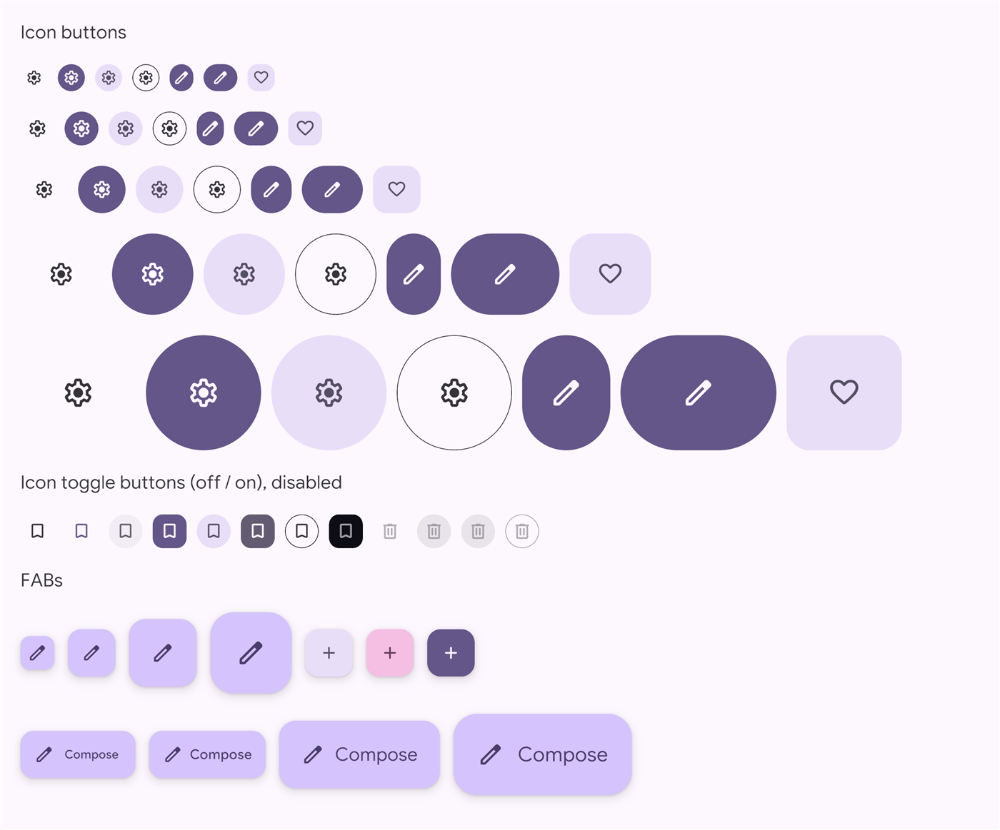 | 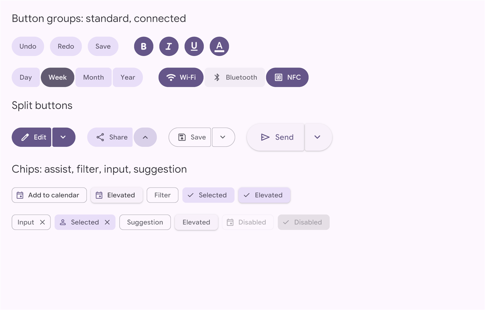 |
| 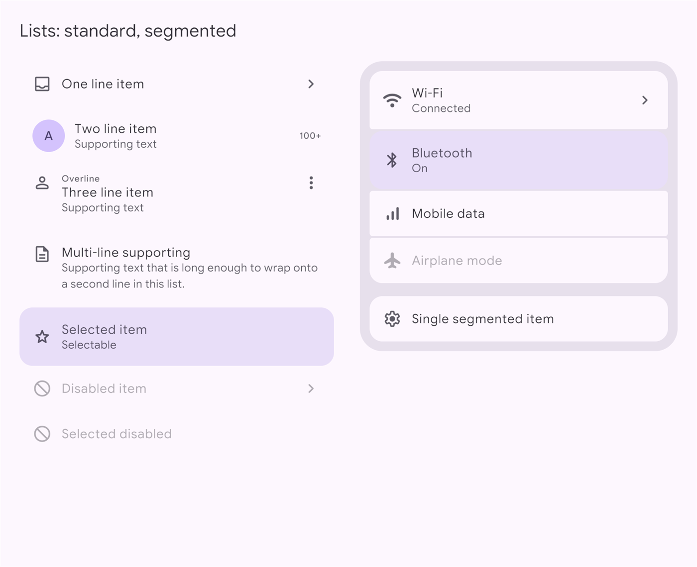 | 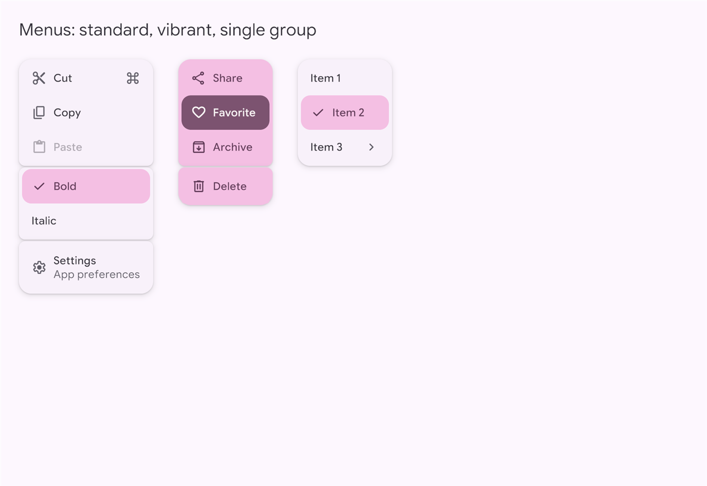 |
| 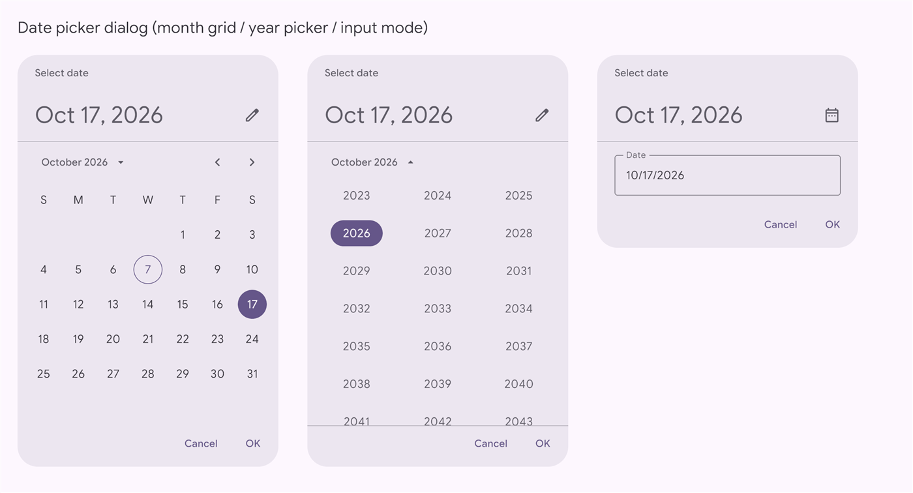 | 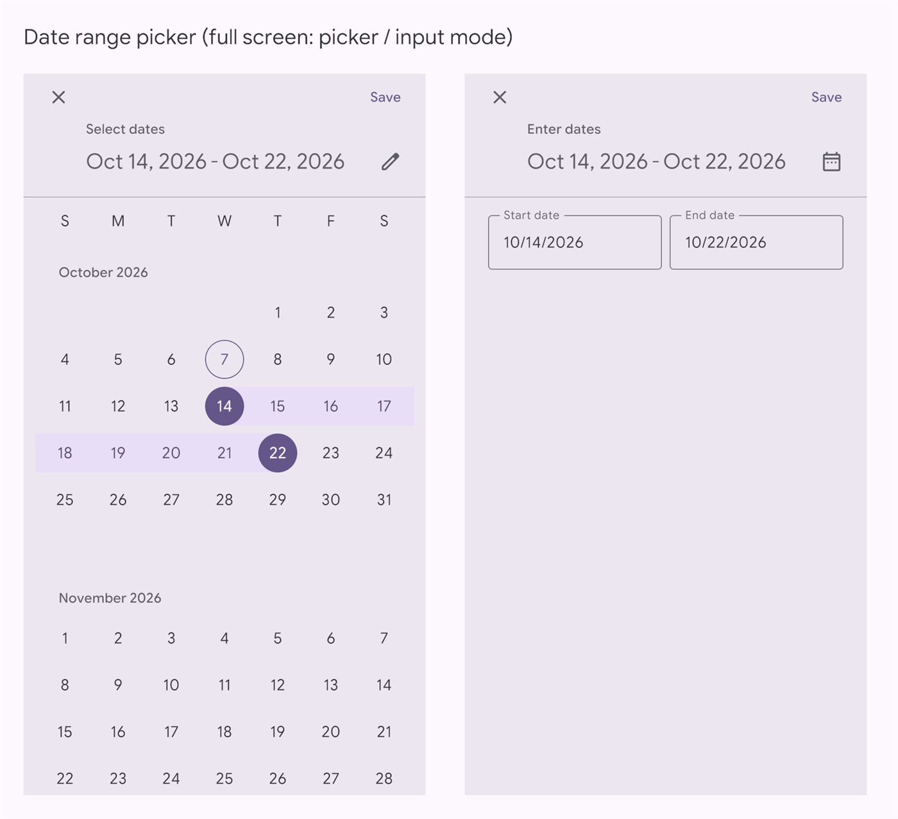 |
| 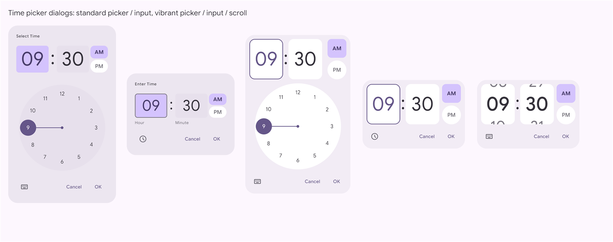 | 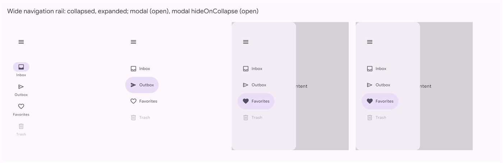 |
| 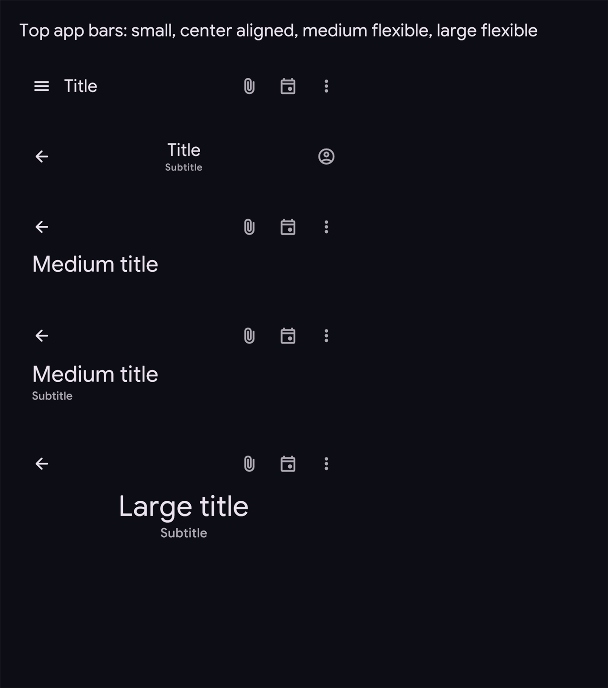 | 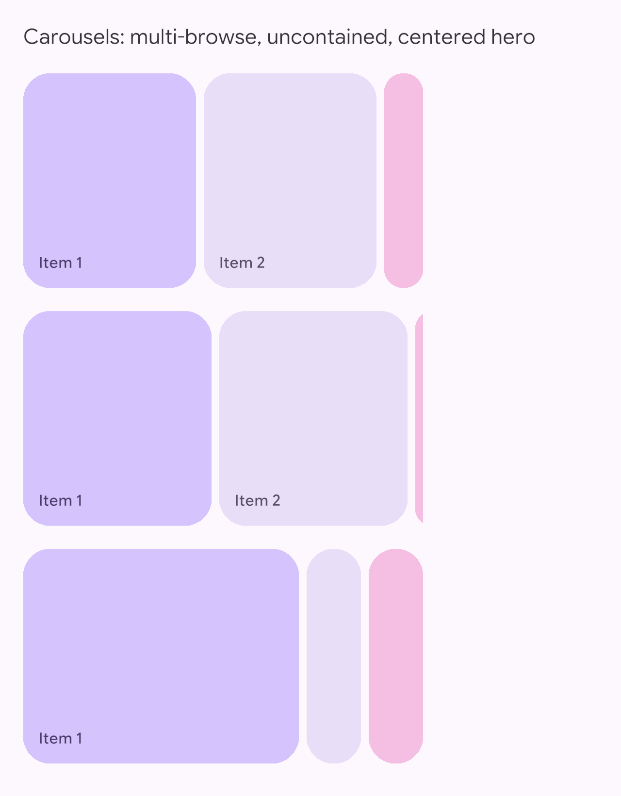 |

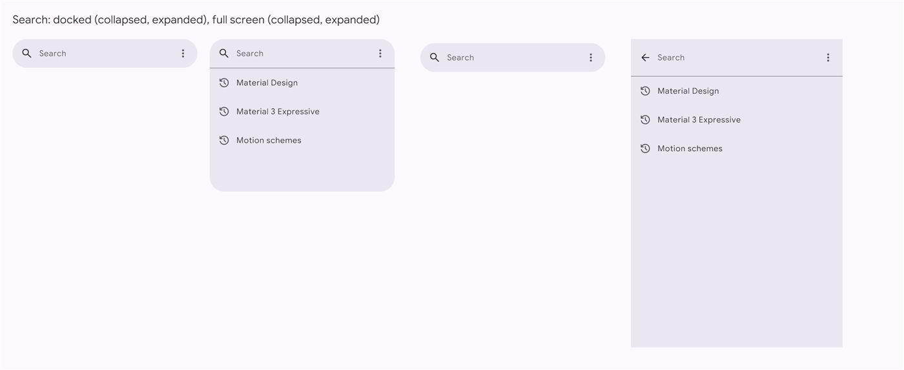

- **Buttons**: all sizes, round / square shapes, toggle buttons, connected and split buttons, button groups, segmented buttons.
- **Icon buttons and FABs**: icon buttons (all styles and widths), FABs, extended FABs, FAB menu.
- **Selection**: checkbox, radio button, switch, sliders (standard, discrete, centered, range).
- **Progress**: linear and circular progress (including wavy), loading indicator.
- **Containment**: cards, badges, dividers, chips, lists (expressive and segmented).
- **Input**: filled and outlined text fields, docked and full-screen search.
- **Overlays**: menus (expressive groups), dialogs, snackbars, tooltips (plain and rich), modal bottom sheet.
- **Navigation**: short navigation bar, wide navigation rail (standard and modal), modal navigation drawer, tabs, top app bars (small, center-aligned, medium and large flexible), floating and docked toolbars.
- **Pickers**: date picker (month grid, year picker, text input), full-screen date range picker, time pickers (clock dial, text input, scroll wheels; standard and vibrant dialogs with mode toggles), scroll field.
- **Carousel**: multi-browse, uncontained, centered hero.

## Installation

Requirements: Unity 2022.3 with uGUI and TextMesh Pro 3.0.6. For VRChat worlds, the VRChat Worlds SDK 3.x with UdonSharp.

1. Add the package in one of these ways:
   - **VRChat Creator Companion / ALCOM**: open https://naryuki.github.io/M3E4Unity/ and press *Add to VCC*, or add `https://naryuki.github.io/M3E4Unity/index.json` in *Settings > Packages > Add Repository*. Then add *M3E4Unity* to your project from *Manage Project*; new versions show up there.
   - **Unity Package Manager (git URL)**: *Window > Package Manager > + > Add package from git URL…* and enter the URL with the version tag:
     ```
     https://github.com/NarYuki/M3E4Unity.git?path=/Packages/com.m3e4unity#v0.1.0
     ```
     To update, change the tag (`#v0.2.0`, …).
   - **From a release**: download `com.m3e4unity-X.Y.Z.unitypackage` (imports into `Packages/com.m3e4unity`) or `com.m3e4unity-X.Y.Z.zip` (*Add package from tarball/disk…*) from [Releases](https://github.com/NarYuki/M3E4Unity/releases).
2. Import *TMP Essential Resources* if the project does not have them yet (*Window > TextMeshPro > Import TMP Essential Resources*).
3. VRChat projects only: the UdonSharp program assets for the runtime behaviours are created automatically in `Assets/M3E4Unity.Generated/Udon`. *Tools > M3E4Unity > Developer > Regenerate UdonSharp Assets* recreates them.

The runtime behaviours compile as `UdonSharpBehaviour`s when `UDONSHARP` is defined (VRChat projects) and as `MonoBehaviour`s otherwise, from the same source.

## Quick start

From the menus:

1. *Tools > M3E4Unity > Create World Space Canvas (VRChat)* or *Create Screen Space Canvas*.
2. Select the canvas or an object inside it, then add components from *GameObject > M3E4Unity > …*.
3. Edit the theme asset (`Assets/M3E4Unity.Generated/M3Theme.asset`): the schemes (seed color, variant, light / dark, contrast), the motion scheme and the fonts. Then run *Tools > M3E4Unity > Apply Theme to Selected Canvas*.
4. *Tools > M3E4Unity > Build Component Catalog* builds a scene with every component in every scheme.

From editor code:

```csharp
using M3E4Unity.Editor;
using M3E4Unity.Tokens;
using UnityEngine;

var theme = M3Canvas.DefaultTheme();
var canvas = M3Canvas.Create("UI", theme, new Vector2(412, 915), worldSpace: true);
M3Canvas.Surface(canvas);
var ctx = new M3Context(theme);

var column = M3Build.Rect("Content", canvas);
M3Build.Fill(column, 16, 16, 16, 16);
M3Build.Column(column, 16);

M3Buttons.Create(column, ctx, "Save", ButtonStyle.Filled, ButtonSize.Medium, leadingIcon: "save");
M3TextFields.Create(column, ctx, TextFieldStyle.Outlined, "Name");
M3Lists.List(column, ctx, new[] { new ListItemSpec { Headline = "Inbox", LeadingIcon = "inbox" } }, 380);
M3TimePickers.Dialog(column, ctx, hour: 9, minute: 30, vibrant: true);

M3Canvas.ApplyTheme(canvas.gameObject); // bake the palettes into the canvas
```

At runtime:

- Each canvas has an `M3Theme` behaviour holding a palette for every scheme of the theme asset. `M3Theme.SetScheme(index)` or `NextScheme()` (also a custom event) switches light / dark / contrast / seed at runtime.
- Components send events to their `changeListener`: `_M3SelectionChanged`, `_M3SliderChanged`, `_M3RangeChanged`, `_M3TextChanged`, `_M3NavChanged`, `_M3TabChanged`, `_M3DateChanged`, `_M3TimeChanged`, `_M3SearchPicked`.
- Icons are Material Symbols codepoints: `M3Icons.Glyph("settings")`. Rounded, Outlined and Sharp are bundled, each at FILL 0 and 1.

## Showcase app

`Showcase/` is a plain Unity project with an app that shows every component on its own page and lets you use them: click, drag and type, switch pages, and change the theme live (5 seed colors × 9 scheme variants × light / dark × 3 contrast levels, all baked into the canvas). An event log shows the components' change events.

1. Open `Showcase/` with Unity 2022.3 (it references the package in this repository).
2. *Tools > M3E4Unity > Showcase > Build Showcase Scene*, then press Play — or *Build Windows App* for a standalone build (`Showcase/Build/M3E4Unity Showcase.exe`).

Batch mode: `-executeMethod M3E4Unity.Editor.Dev.M3Showcase.BatchBuild` builds the scene and the player (set `M3_SHOWCASE_OUT` to choose the output path). `M3E4Unity.Editor.Dev.M3Showcase.SelfTest` sends every theme / refresh event to every behaviour before `Start` and reports the ones that throw.

## How it works

- **Shapes** are uGUI `Image`s using `M3Shape.shader`. Each sprite is a cell of a small parameter atlas encoding the kind, corner radii, stroke, blur and so on; the shader evaluates an analytic SDF, so edges stay sharp at any scale, including in VR. Shape morphs and ripples step through pre-made cells.
- **Colors** are resolved per scheme with the material-color-utilities port and pre-composited in sRGB at bake time (state layers over containers), so they match Compose in both linear and gamma projects. Each scheme is a palette; switching schemes re-colors every graphic.
- **Elevation** uses the material-web key / ambient shadow model.
- **Motion** steps Compose's spring equations in closed form every frame (`SendCustomEventDelayedFrames`), with the motion scheme's damping and stiffness baked in.
- **Layout** reproduces the Compose measure policies at build time; parts that animate (navigation rail, app bars, pickers…) lay themselves out at runtime.

## Known differences

- VRChat (Udon) cannot set `TMP_InputField.caretColor` at runtime, so the caret uses the colors baked for the default scheme.
- Udon receives no pointer positions, so gestures that need them are approximated:
  - the time picker dial reacts to taps on the numbers, not to dragging;
  - the range slider assigns a press to the closer thumb by splitting the track between the thumbs;
  - the carousel uses a ScrollRect and snaps one item at a time.
- Date input: Udon cannot move the TMP caret, so in VRChat the `/` delimiters are added when editing ends instead of while typing (plain Unity inserts them as you type, like Compose).
- Date range picker: the day hover / press layers are blended by the GPU (translucent) instead of pre-composited, because a day can sit on the range background.
- Scroll field: TMP font size and weight cannot be animated from Udon, so the selected item scales a displayMedium text and cross-fades to a copy with the emphasized weight. Mouse-wheel scrolling does not snap.
- Time input: in VRChat the focus does not move to the minute field automatically (TMP focus calls are not exposed to Udon).
- Text field label: TMP font size is not exposed to Udon, so the label animates with a scale. Letter spacing differs from Compose's interpolated style by about 0.03 px per character.
- The motion scheme (standard / expressive) is chosen when the UI is built, not at runtime.

## Repository layout

```
Packages/com.m3e4unity/     the Unity package
  Runtime/Core/             color (material-color-utilities port), tokens, shapes, motion, carousel keylines
  Runtime/Udon/             runtime behaviours (UdonSharp or MonoBehaviour)
  Runtime/Markers/          theme asset and bake-time markers
  Runtime/Showcase/         the showcase app (plain Unity only)
  Editor/                   builders for every component, the theme baker, menus
  Shaders/, Fonts/          the SDF shape shader; Google Sans Flex, Roboto Flex, Noto Sans JP, Material Symbols
Showcase/                   plain Unity project for the showcase app
Tests/                      golden color tests (CoreTests) and a fast compile check (UnityCompile)
tools/                      porting and generation scripts
docs/images/                screenshots
```

## Development

- Releases: bump `version` in `Packages/com.m3e4unity/package.json`, then push a tag `vX.Y.Z` with the same version. The *Release (VPM listing)* workflow attaches the package zip and `.unitypackage` to the release and adds the version to the VCC listing on GitHub Pages.
- `tools/port_mcu.ps1` re-ports material-color-utilities; `Tests/golden` + `Tests/CoreTests` compare the port with the Java original.
- `tools/kt_tokens.py` regenerates the tokens from Compose.
- `Tests/UnityCompile` compiles the package against the Unity DLLs without opening Unity: `dotnet build Tests/UnityCompile -p:UnityProject=<a Unity project>`; add `-p:VRChat=false` for the plain-Unity path (the default expects a VRChat project).
- `tools/unity_batch.ps1 -Project <project>` runs an editor method in batch mode; the default (`M3Batch.Catalog`) builds the catalog and renders every page to `Shots/`.

The upstream sources used for porting (Compose Material 3, graphics-shapes, material-color-utilities, fonts) are fetched separately and are not part of this repository.

## License

Apache License 2.0, see [LICENSE](LICENSE). Third-party notices (material-color-utilities, AndroidX Compose Material 3 and graphics-shapes, material-web, and the bundled fonts under the SIL Open Font License 1.1 / Apache 2.0) are in [NOTICE](NOTICE).

Material Design, Material You and Material 3 are trademarks of Google LLC. This project is not affiliated with or endorsed by Google.

---

## 日本語

M3E4Unity は **Material 3 Expressive を Unity uGUI に移植したライブラリ**です。
見た目を真似て作り直したものではありません。Jetpack Compose Material 3・material-color-utilities・AndroidX graphics-shapes の公式ソースから、レイアウトの値・色・形・スプリングアニメーションをそのまま移しています。
通常の Unity と VRChat ワールド（UdonSharp）の両方で動きます。

### できること

- ダイナミックカラー：全スキームバリアント・コントラスト・ライト/ダーク。Java 版の出力と照合し、7,168 スキームで差異 0 です。
- Compose のトークン（2,537 値）、MaterialShapes 35 種と形のモーフィング、Expressive / Standard のスプリングモーション。
- Expressive の全コンポーネントがあります（ボタン各種、FAB、チップ、リスト、テキストフィールド、検索、メニュー、ダイアログ、ナビゲーション各種、タブ、アプリバー、ツールバー、日付・期間・時刻ピッカー、カルーセルなど）。
- 図形は SDF シェーダーで描くので、VR で近づいても輪郭がにじみません。

### 導入

1. 次のどれかで追加します。
   - **VRChat Creator Companion / ALCOM**：https://naryuki.github.io/M3E4Unity/ を開き、*Add to VCC* を押します。または *Settings > Packages > Add Repository* に `https://naryuki.github.io/M3E4Unity/index.json` を追加します。そのあと *Manage Project* から M3E4Unity を追加します。新しい版もそこに表示されます。
   - **Unity Package Manager（git URL）**：*Add package from git URL…* に、版のタグ付きの URL を入力します。
     ```
     https://github.com/NarYuki/M3E4Unity.git?path=/Packages/com.m3e4unity#v0.1.0
     ```
     更新するときは、タグ（`#v0.2.0` など）を書き換えます。
   - **リリースから入れる**：[Releases](https://github.com/NarYuki/M3E4Unity/releases) から `com.m3e4unity-X.Y.Z.unitypackage`（`Packages/com.m3e4unity` に取り込まれます）か、`com.m3e4unity-X.Y.Z.zip` をダウンロードします。
2. TMP Essential Resources が未導入なら、*Window > TextMeshPro* から導入します。
3. VRChat プロジェクトでは、UdonSharp のプログラムアセットが自動で作られます。

### 使い方

1. *Tools > M3E4Unity > Create … Canvas* でキャンバスを作ります。
2. *GameObject > M3E4Unity* からコンポーネントを追加します。
3. テーマ（シード色・バリアント・ライト/ダーク・コントラスト・モーション・フォント）は `M3Theme.asset` を編集し、*Apply Theme* で反映します。
4. 実行中は `M3Theme.SetScheme(index)` でスキームを切り替えられます。

### ショーケースアプリ

`Showcase/` は、全コンポーネントを触って試せるアプリの Unity プロジェクトです。
Unity 2022.3 で開き、*Tools > M3E4Unity > Showcase > Build Showcase Scene* を実行してから Play してください。*Build Windows App* で exe も作れます。
テーマ（5 色 × 9 バリアント × ライト/ダーク × 3 段階のコントラスト）をその場で切り替えられ、操作イベントのログも表示されます。

### 制約

VRChat（Udon）の制約による差分は「[Known differences](#known-differences)」に書いています。主なもの：

- 時刻ダイヤルはドラッグではなく、数字のタップで操作します。
- 日付入力の「/」は、入力を確定したときに入ります。
- キャレットの色は既定スキームの色で固定されます。

### ライセンス

Apache-2.0 です。同梱フォントは OFL 1.1 / Apache-2.0 です。詳しくは [NOTICE](NOTICE) を参照してください。
Material Design は Google LLC の商標です。本プロジェクトは Google とは無関係です。
